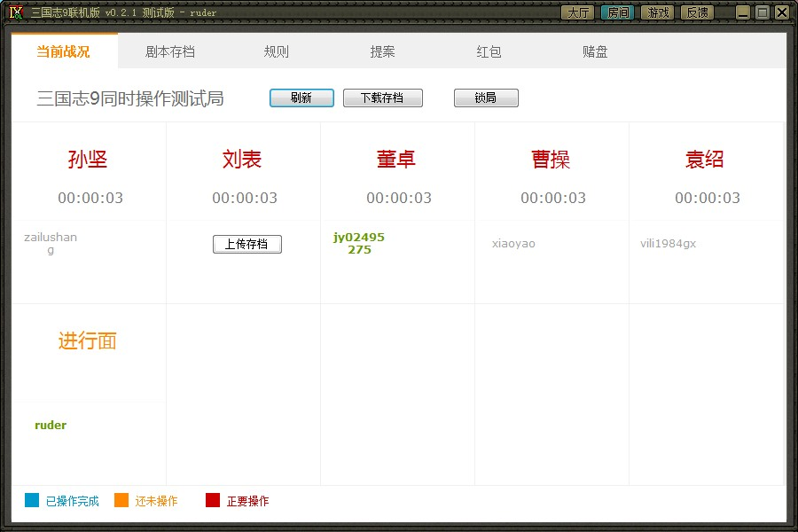
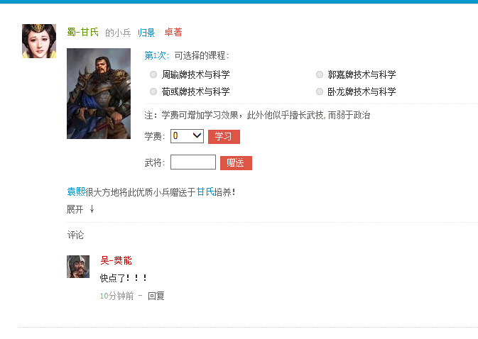
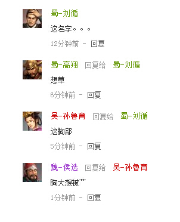
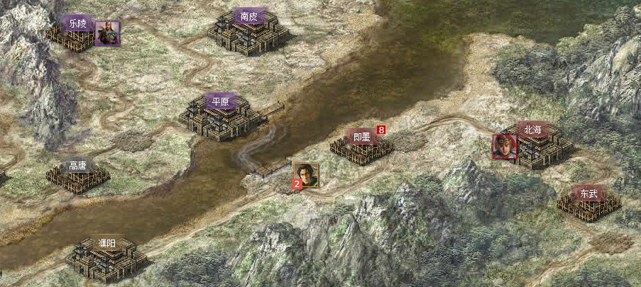
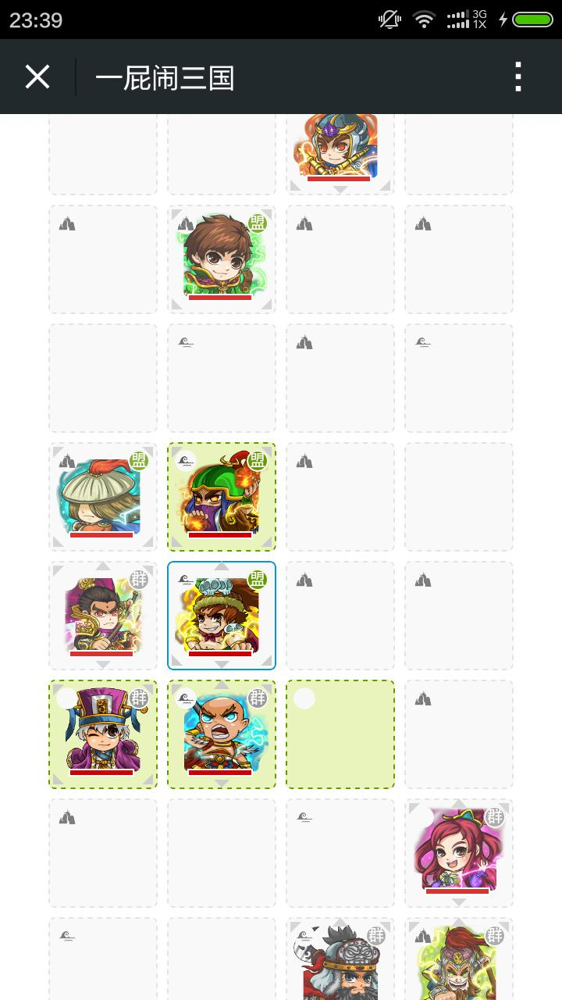
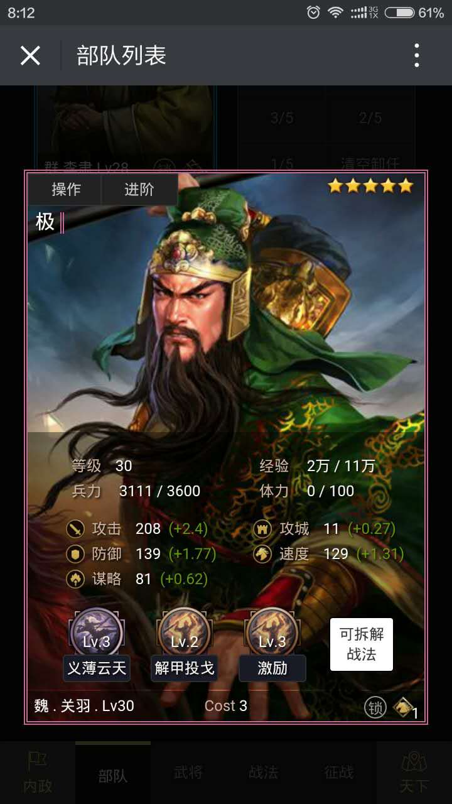
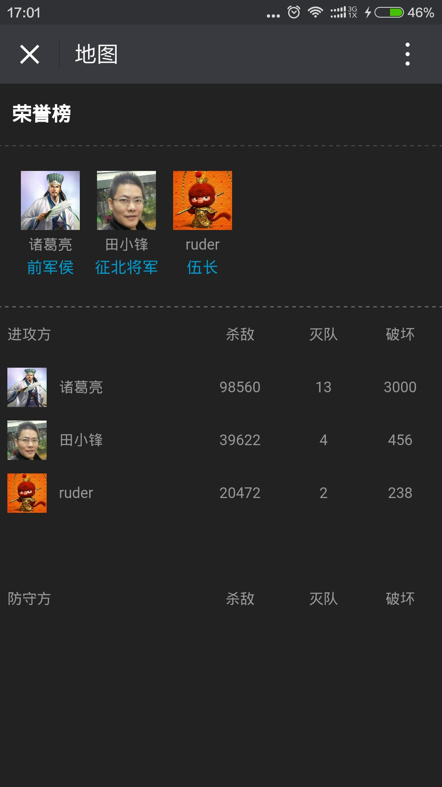

一屁闹三国是2012年由韩国天，Gong-X，拓跋小宝，慕容起（排名不分先后）等一帮文艺范二逼青年组成网络小团队共同发起和打造的游戏。
前前后后一共大改版了5次，又或者说是做了5个游戏。

## 第一版
**三国志9网络对战平台**

当年我们酷爱玩三国志9，然其只是一个单机游戏，无法满足多人在线玩的需求。
于是我们便出了个网络联机版，取名为《三国志9网络对战平台》，大概界面如下：

 

## 第二版
**三国角色扮演微博版**

因三国志9对战定了好多规则，入门难度高。于是便出一个网页版的社交游戏，每个玩家扮演三国里的人物，发掘小兵组成部队参加团队战斗。没事通过微博方式吹吹牛皮，然后你就看到一堆诸葛亮大骂刘备和黄月英的一些破事，无比有趣。
来几张界面图：

  
 

## 第三版
**半即时大地图团战策略游戏**

这版玩家反应最好的一次，作为三国志的粉丝，对一个大地图还是相当执着的，这份执着让我们开始了这版本的开发。这版本的亮点是所有细节是由剧本设定的，剧本可以有玩家编辑，所有还出现过魔兽三国的剧本。

 

## 第四版
**三国社交轻手游**

随着移动互联网的发展，手机使用频率越来越多，而以前的各个版本都是桌面版，对手机支持度相当不友好，于是我们便出了个手游。这版游戏主要是将游戏结合到类似微信聊天里去，社交中玩游戏。

 
 
 

## 第五版
**微信公众号游戏**

无意中发现，我们的轻手游放在公众号是一个很不错的主意，于是便出现这一版本。当时网易的《率土之滨》刚出来，我们很喜欢，那就山寨一个吧，于是便有了这个版本。
在这里提下关于抄袭的看法，我们没有很重的道德担子，你好我就学，说好听叫参考，说难听就是“来啊你骂我啊”。我们首要目的是根据目前的资源做出一个好游戏，其它皆是手段！
欲成事，勿犹豫！

 
 

## 为什么做这个游戏

> 想玩个游戏，找不到喜欢的，那就自己做一个吧！

目前虽然游戏众多，但同质化严重，人嘛，总有些不一样的追求，总想玩点不一样的东西来让自己装逼，显得自己多文艺范。
面对别人不一样的声音，作为二逼青年的我们是不回应的。

## 未来的打算

未来我们会持续完善，可能会继续改版。但均是偏离主流游戏，玩不一样，又称《独立游戏》！
如果你对我们有兴趣，可以加我微信（下图），我们随时欢迎具有共同志向的朋友！ 
PS:现在搜索微信公众号《一屁闹三国》就是目前的第五版。

 